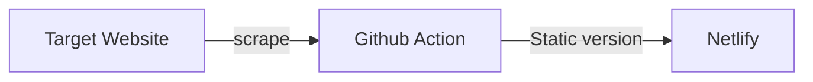

<h3 align="center">Scrape site and push to Netlify</h3>

Github Action to scrape a website, make a static version and push to netlify.

    

##  1. Table of Contents

* 1. [Table of Contents](#TableofContents)
* 2. [About The Project](#AboutTheProject)
	* 2.1. [Built With](#BuiltWith)
	* 2.2. [Installation](#Installation)
* 3. [Usage](#Usage)
* 4. [ Customising](#Customising)
* 5. [Troubleshooting](#Troubleshooting)
* 6. [Contributing](#Contributing)
* 7. [License](#License)
* 8. [Contact](#Contact)
* 9. [Changelog](#Changelog)

##  2. About The Project

The basic steps are:

- Scrape target with `wget`
- Remove query strings
- Push to Netlify

(<a href="#top">back to top</a>)

###  2.1. Built With

This project was built with the following frameworks, technologies and software.

* [Github](https://github.com/)

(<a href="#top">back to top</a>)

###  2.2. Installation

The action needs two secrets setup:

- `NETLIFY_AUTH_TOKEN`
- `NETLIFY_SITE_ID`

You can get both from netlify.

(<a href="#top">back to top</a>)

##  3. Usage

The action will run manually through the github GUI. If you add `-test` in the commit message, the action will disable.

##  4.  Customising

This was initially created to scrape a Ghost.org blog for IORoot hosted on Heroku.

Why Heroku? Well, it's free. And you can link a DB and CDN to the free instance. So Ghost will work on it.

Once I've made any changes on Heroku, I'd head over to github and run this action.

The action would scrape the heroku dyno and generate a static version of the website. 

It then pushes the result over to Netlify.

The github action has a single variable called `scrapetarget` that you can point anywhere.

##  5. Troubleshooting

None.

(<a href="#top">back to top</a>)

##  6. Contributing

Contributions are what make the open source community such an amazing place to learn, inspire, and create. Any contributions you make are **greatly appreciated**.

If you have a suggestion that would make this better, please fork the repo and create a pull request. You can also simply open an issue.
Don't forget to give the project a star! Thanks again!

1. Fork the Project
2. Create your Feature Branch (`git checkout -b feature/AmazingFeature`)
3. Commit your Changes (`git commit -m 'Add some AmazingFeature'`)
4. Push to the Branch (`git push origin feature/AmazingFeature`)
5. Open a Pull Request

(<a href="#top">back to top</a>)

##  7. License

Distributed under the MIT License.

MIT License

Copyright (c) 2022 Andy Pearson

Permission is hereby granted, free of charge, to any person obtaining a copy
of this software and associated documentation files (the "Software"), to deal
in the Software without restriction, including without limitation the rights
to use, copy, modify, merge, publish, distribute, sublicense, and/or sell
copies of the Software, and to permit persons to whom the Software is
furnished to do so, subject to the following conditions:

The above copyright notice and this permission notice shall be included in all
copies or substantial portions of the Software.

THE SOFTWARE IS PROVIDED "AS IS", WITHOUT WARRANTY OF ANY KIND, EXPRESS OR
IMPLIED, INCLUDING BUT NOT LIMITED TO THE WARRANTIES OF MERCHANTABILITY,
FITNESS FOR A PARTICULAR PURPOSE AND NONINFRINGEMENT. IN NO EVENT SHALL THE
AUTHORS OR COPYRIGHT HOLDERS BE LIABLE FOR ANY CLAIM, DAMAGES OR OTHER
LIABILITY, WHETHER IN AN ACTION OF CONTRACT, TORT OR OTHERWISE, ARISING FROM,
OUT OF OR IN CONNECTION WITH THE SOFTWARE OR THE USE OR OTHER DEALINGS IN THE
SOFTWARE.

(<a href="#top">back to top</a>)

##  8. Contact

Author Link: [https://github.com/IORoot](https://github.com/IORoot)

(<a href="#top">back to top</a>)

##  9. Changelog

- v1.0.0 - Initial Commit
